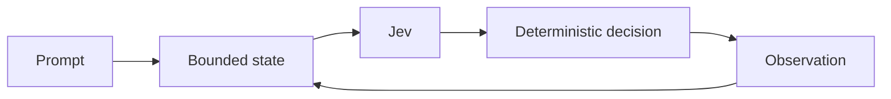

# Data flow

```mermaid
flowchart LR
P[Prompt]-->S[Bounded state]
S-->J[Jev]
J-->D[Deterministic decision]
D-->O[Observation]
O-->S
```
Raw tool output is normalized and redacted before bounded persistence or semantic use.

Related: [documentation index](../README.md)
