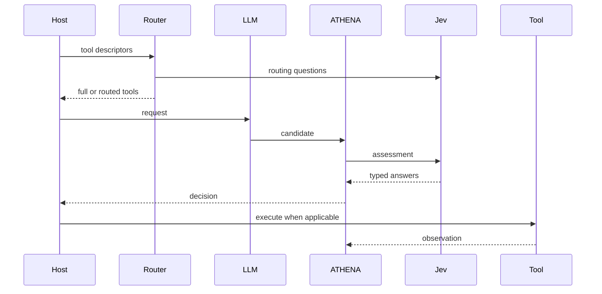

# Request lifecycle

```mermaid
sequenceDiagram
participant H as Host
participant R as Router
participant L as LLM
participant A as ATHENA
participant J as Jev
participant T as Tool
H->>R: tool descriptors
R->>J: routing questions
R-->>H: full or routed tools
H->>L: request
L->>A: candidate
A->>J: assessment
J-->>A: typed answers
A-->>H: decision
H->>T: execute when applicable
T-->>A: observation
```

Related: [documentation index](../README.md)
