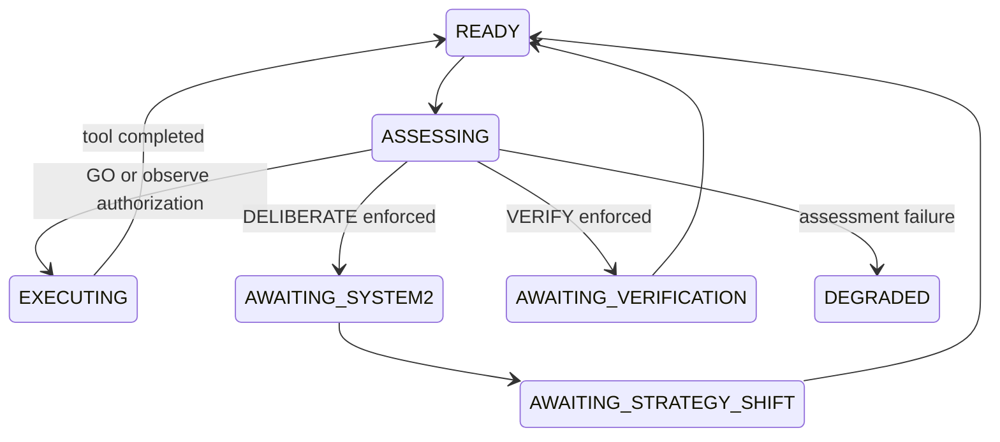

# Runtime state machine

Actual phases are `READY`, `ASSESSING`, `EXECUTING`, `AWAITING_SYSTEM2`, `AWAITING_STRATEGY_SHIFT`, `AWAITING_VERIFICATION`, and `DEGRADED`.

Related: [documentation index](../README.md)
