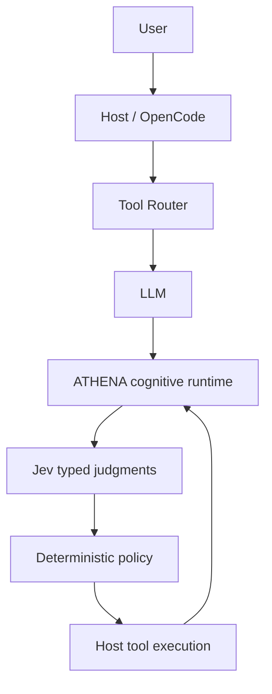

# 60-second mental model

Without ATHENA, a host sends a prompt and tools to a model, then executes a proposed tool call. With ATHENA, the host can first route visible capabilities, then ATHENA evaluates each proposed action against a compact WorldState.

LLM thinks. Jev judges. ATHENA controls or observes. Tools execute. In default observe mode, policy is visible but non-authoritative.
